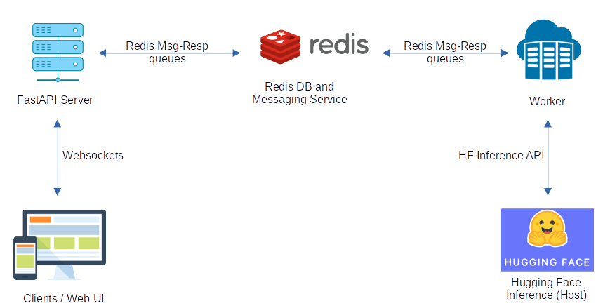
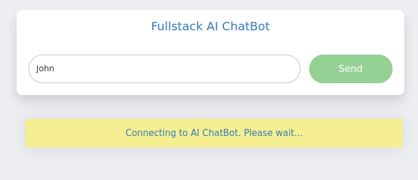
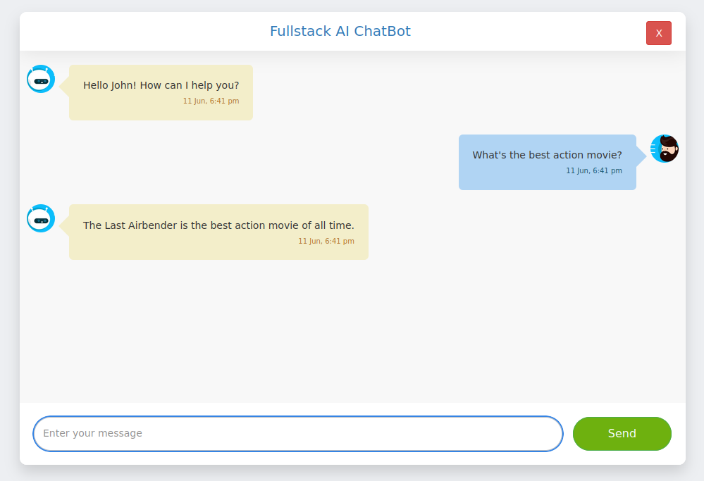

A demo of a fullstack AI chatbot using FastAPI, Redis and Hugging Face Inference API. 
[FastAPI](https://fastapi.tiangolo.com/) is used for the webserver talking to Client with REST and Websocket endpoints.
Client is a simple js/jquery based UI.
[Redis enterprise cloud](https://redis.com/try-free) DB (free) instance is used as cache to save chat data.
Redis is also used for message queues (message channel and response channel) between Server and Worker.
Worker connects to Redis streams/channels to communicate with server and also connects to Hugging Face On Demand [Inference API](https://huggingface.co/docs/api-inference/detailed_parameters#conversational-task) to query a hosted model.
The backend is based on an in depth [tutorial](https://blog.stephensanwo.dev/build-a-fullstack-ai-chatbot/series) by Stephen Sanwo written in collaboration with Redis. The frontend UI is based on a [simple UI](https://github.com/PandaWhoCodes/chatbot-frontend/) project.

Environment variables:  
Set app environment to development (for dev).  
export APP_ENV=development

Add a .env file under /server and one under /worker.  
Add Redis config to both files:  
export REDIS_URL=  
export REDIS_USER=  
export REDIS_PASSWORD=  
export REDIS_HOST=  
export REDIS_PORT=  

Add Hugging Face config to .env under worker:  
export HUGGINGFACE_INFERENCE_TOKEN=  
export MODEL_URL=  

  
